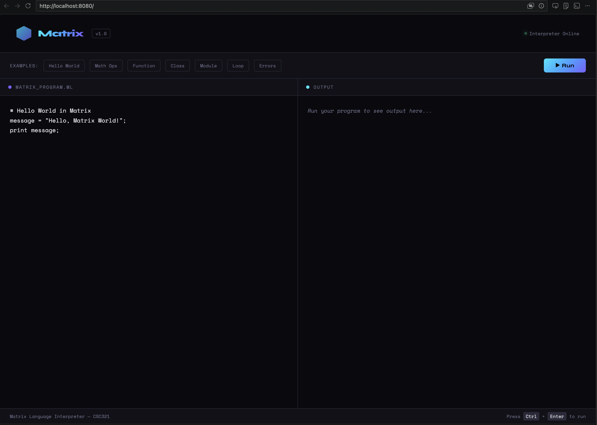

# Matrix Language

**Matrix** is a custom-built, interpreted programming language created for **solving math equations which emphasizes strict rules in order to ensure less failure.** It is written in Python and served through a Flask web application, giving it a fully functional browser-based IDE where code can be written and executed in real time.

---

Matrix is a statically-typed, expression-based language with strict immutability rules. It supports all the core concepts expected of a working programming language: data types, variables, arithmetic, control flow, functions, classes, modules, arrays, and structured error handling. Code is typed into an editor on the left and output appears on the right — no setup required.

---
## Project Structure
```
Matrix/
  src/
    lexer.py       - tokenizer, breaks code into tokens
    parser.py      - builds the Abstract Syntax Tree
    ast_nodes.py   - defines all AST node types
    evaluator.py   - executes the AST, enforces language rules
  app.py           - Flask web server and UI
  requirements.txt - dependencies (Flask)
  render.yaml      - Render deployment config
```

## To Run Locally
```
pip install flask
python app.py
```
Then open http://localhost:5000 in your browser.

## To Run on Render
The project is deployed at https://matrix-3d75.onrender.com
No installation needed, open the URL in any browser.


---

## GUI



## Architecture

The interpreter is split into four components:

| File | Role |
|------|------|
| `lexer.py` | Tokenizes source code into a stream of tokens |
| `parser.py` | Builds an Abstract Syntax Tree (AST) from tokens |
| `ast_nodes.py` | Defines all AST node types |
| `evaluator.py` | Walks the AST and executes the program |
| `app.py` | Flask web server + browser-based IDE |

---

## Language Features

### Data Types

Matrix supports six primitive types. Mixing types in arithmetic is a runtime error — explicit conversion is required.

| Type | Example |
|------|---------|
| `integer` | `x = 42;` |
| `float` | `x = 3.14;` |
| `string` | `x = "hello";` |
| `boolean` | `x = true;` |
| `null` | `x = null;` |
| `array` | `x = [1, 2, 3];` |

**Type conversion built-ins:** `int()`, `float()`, `str()`, `bool()`

---

### Variables & Immutability

Variables in Matrix are **immutable by default** — once assigned in a scope, they cannot be reassigned. This is a deliberate design feature.

```matrix
x = 10;
x = 20;   # ERROR: Variable 'x' is already defined and cannot be reassigned.
```

---

### Arithmetic Operators

```matrix
x = 10;
y = 3;

print x + y;    # 13
print x - y;    # 7
print x * y;    # 30
print x / y;    # 3.3333...
print x // y;   # 3   (integer division)
print x % y;    # 1   (remainder)
print x ** 2;   # 100 (power)
```

The `@` operator performs **matrix multiplication** on 2D arrays.

---

### Control Flow

**If / Else:**
```matrix
x = 10;
if (x > 5) {
    print "big";
} else {
    print "small";
}
```

**While loop with break:**
```matrix
i = 0;
while (i < 5) {
    print i;
    if (i == 3) {
        break;
    }
    i = i + 1;
}
```

---

### Functions

Functions support recursion and closures. Argument count is strictly enforced.

```matrix
function factorial(n) {
    if (n == 0) {
        return 1;
    }
    result = n * factorial(n - 1);
    return result;
}

print factorial(5);   # 120
```

---

### Classes

Classes define methods that are called on instances via dot notation.

```matrix
class Rectangle {
    function area(w, h) {
        return w * h;
    }
    function perimeter(w, h) {
        return 2 * (w + h);
    }
}

r = Rectangle();
print r.area(5, 3);        # 15
print r.perimeter(5, 3);   # 16
```

---

### Modules

Modules are named namespaces that group related functions together.

```matrix
module MathUtils {
    function square(n) {
        return n * n;
    }
    function cube(n) {
        return n * n * n;
    }
}

print MathUtils.square(4);   # 16
print MathUtils.cube(3);     # 27
```

---

### Arrays & Indexing

```matrix
arr = [10, 20, 30, 40, 50];
print arr[0];   # 10
print arr[4];   # 50
```

Strings also support index access:
```matrix
s = "hello";
print s[0];   # h
```

---

### Comments

```matrix
# This is a single-line comment
x = 5;   # inline comment
```

---

## Error Handling

Matrix produces descriptive runtime errors across several categories:

| Error Type | Trigger |
|------------|---------|
| `LexerError` | Unknown character in source |
| `ParseError` | Syntax violation |
| `TypeError` | Mixing incompatible types, wrong operator usage |
| `ImmutabilityError` | Reassigning an already-defined variable |
| `UndefinedError` | Using a variable or member that doesn't exist |
| `DivisionByZeroError` | Dividing by zero |
| `IndexError` | Array or string index out of bounds |
| `ArgumentError` | Wrong number of arguments passed to a function |

All errors include the offending line number and a clear message.

---

## Example Programs

The IDE includes seven built-in examples accessible from the toolbar:

- **Hello World** — string variable and print
- **Math Ops** — arithmetic, integer division, type conversion
- **Function** — recursive factorial
- **Class** — Rectangle with area and perimeter methods
- **Module** — MathUtils namespace
- **Loop** — array traversal and while loop with break
- **Errors** — commented-out examples of each error type

---

## Project Structure

```
Matrix/
├── app.py              # Flask server + web IDE
└── src/
    ├── lexer.py        # Tokenizer
    ├── parser.py       # AST builder
    ├── ast_nodes.py    # AST node definitions
    └── evaluator.py    # Tree-walk interpreter
```
